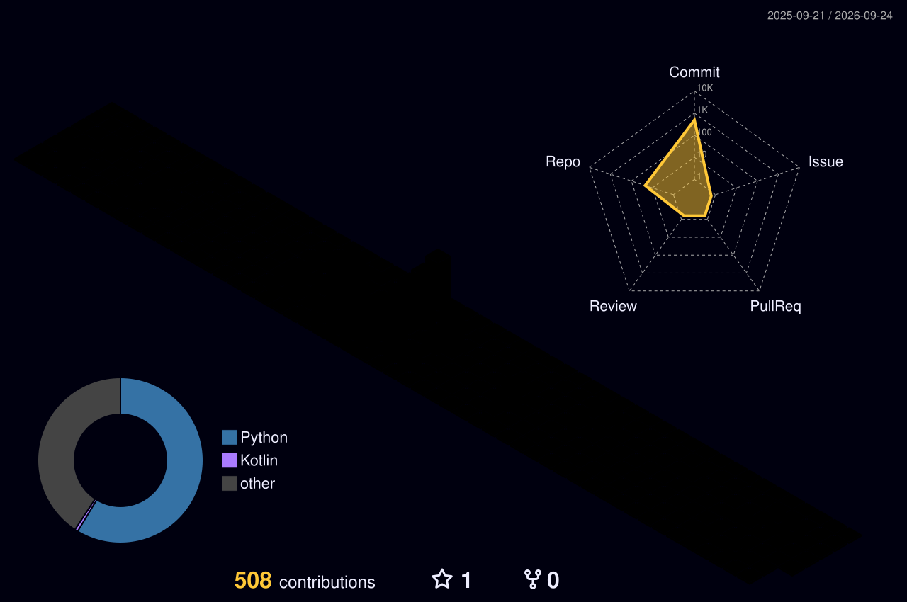

<table>
  <tr>
    <td width="60%" valign="top">

<h1>Hi there, I'm Gokul Krishna 👋</h1>  
<b>Machine Learning Engineer | MLOps Specialist | AI Workflow Architect</b>  

🚀 As a passionate ML engineer, I specialize in building scalable, production-grade AI solutions with a focus on automation, reliability, and performance.  
I thrive at the intersection of data science and DevOps, where engineering meets intelligence.

🧠 With hands-on experience in predictive modeling, real-time inference APIs, and automated training pipelines,  
I enjoy solving real-world problems using tools like FastAPI, MLflow, DVC, Celery, and AWS.

🎯 Whether it’s deploying intelligent systems, optimizing simulation-based models, or orchestrating end-to-end pipelines —  
I aim to build AI that not only works, but works smart.

📌 *Explore some of my featured projects below to see my work in action.*

</td>
<td width="40%" align="center">
  
</td>
  </tr>
</table>

---

## 🚀 Featured Projects

### 🔐 [Phishing Detection API with MLOps](https://github.com/megokul/networksecurity_ml_api)  
A fully modular, production-grade ML pipeline for phishing detection with:

- FastAPI for API serving (`/train`, `/predict`)
- Async training using **Celery + Redis**
- Workflow versioning with **DVC**
- Hyperparameter tuning via **Optuna**
- Experiment tracking using **MLflow + DagsHub**
- Schema + drift validation, preprocessing, and artifact management
- CI/CD with **GitHub Actions**, auto-sync to **AWS S3**

🔗 *Tech:* FastAPI, Scikit-learn, Celery, MLflow, Optuna, AWS, MongoDB, Docker  
📂 *Design:* Modular, YAML-driven, CI/CD-enabled

---

### 📊 [Student Performance Prediction – ML Pipeline](https://github.com/megokul/student_performance)  
A reusable and scalable machine learning pipeline to predict student scores:

- PostgreSQL-based ingestion with table auto-creation from YAML schema
- Configurable preprocessing (scaling, encoding, imputing, column operations)
- Full pipeline: ingestion ➜ validation ➜ transformation ➜ training ➜ evaluation ➜ prediction
- Optuna-powered hyperparameter tuning with MLflow tracking
- Centralized logging with AWS S3 and local backups
- Artifact versioning using DVC

🔗 *Tech:* Scikit-learn, Optuna, PostgreSQL, MLflow, DVC, AWS, YAML  
📂 *Design:* Production-grade, modular, reusable, data-driven, CI/CD-enabled

---

### 🍷 [Wine Quality Prediction – Regression Pipeline](https://github.com/megokul/wine_quality_prediction)  
A Dockerized regression pipeline with a simple web interface for real-time prediction:

- Built using **ElasticNet Regression**
- Flask frontend for user input and result display
- Modular pipeline: ingestion → validation → transformation → training → prediction
- Structured with reusable entity-based config classes
- MLflow-based experiment logging & reproducible config

🔗 *Tech:* Flask, Scikit-learn, MLflow, Docker, YAML  
📂 *Design:* Lightweight, extensible, production-ready

---

## 💼 Professional Experience

**🔹 Data Scientist / CAE Engineer – General Motors (via TCS)**  
*Sep 2019 – Aug 2023 · Bangalore, India*  
- Reduced EV battery module mass by 11% via ML-driven simulation optimization  
- Automated FEA workflows and built predictive models for unseen load conditions  
- Developed Kriging-based optimization and mentored junior engineers in ML-integrated engineering

**🔹 Structural Analyst – Johnson & Johnson MedTech (via TCS)**  
*Feb 2017 – Aug 2019 · Kolkata, India*  
- Optimized design cycles for surgical devices using FE analysis and statistical tools  
- Built automation scripts for structural simulation and data extraction  
- Supported design for novel uterine tumor excision device using biomechanical modeling

---

## 🧩 About Me

- 🛠 **I’m currently working on**  
  Production-grade AI APIs with FastAPI + Celery + MLflow for scalable ML deployment.

- 🤝 **I’m looking to collaborate on**  
  Applied ML projects, MLOps tooling, or LLM use cases in healthcare or finance.

- 🧠 **I’m looking for help with**  
  Model serving at scale and efficient Kubernetes-based deployment.

- 🌱 **I’m currently learning**  
  LLM fine-tuning, Kubeflow pipelines, and advanced ML monitoring strategies.

- 💬 **Ask me about**  
  MLOps pipelines, Kriging optimization, DVC, or real-world AI deployment.

- ⚡ **Fun fact**  
  My first ML pipeline was trained entirely on FEA simulation data—no labeled dataset, just raw physics!

---

## 🌐 Socials

 : [nv-gokul-krishna](https://www.linkedin.com/in/nv-gokul-krishna)

 : [nvgokulkrishna@gmail.com](mailto:nvgokulkrishna@gmail.com)

# 💻 Tech Stack:
                                  
# 📊 GitHub Stats:
 
 

## 🏆 GitHub Trophies

### 🔝 Top Contributed Repo

<!-- Proudly created with GPRM ( https://gprm.itsvg.in ) -->

## 📊 3D GitHub Contributions

## 🕹️ Pac-Man Contribution Graph
<picture>
  <source media="(prefers-color-scheme: dark)" srcset="https://raw.githubusercontent.com/megokul/megokul/output/pacman-contribution-graph-dark.svg">
  <source media="(prefers-color-scheme: light)" srcset="https://raw.githubusercontent.com/megokul/megokul/output/pacman-contribution-graph.svg">
  
</picture>

